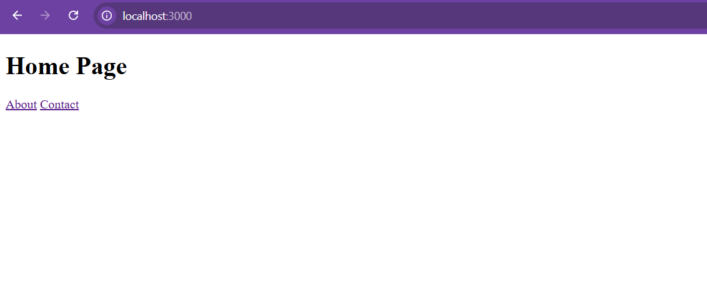
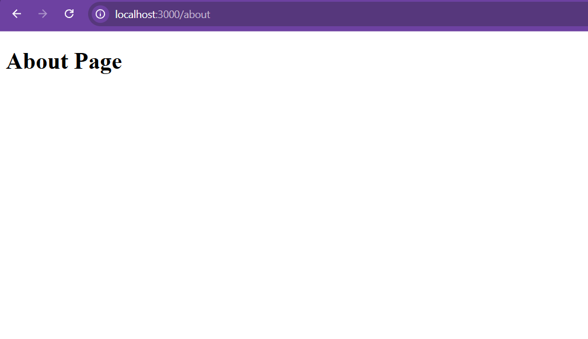
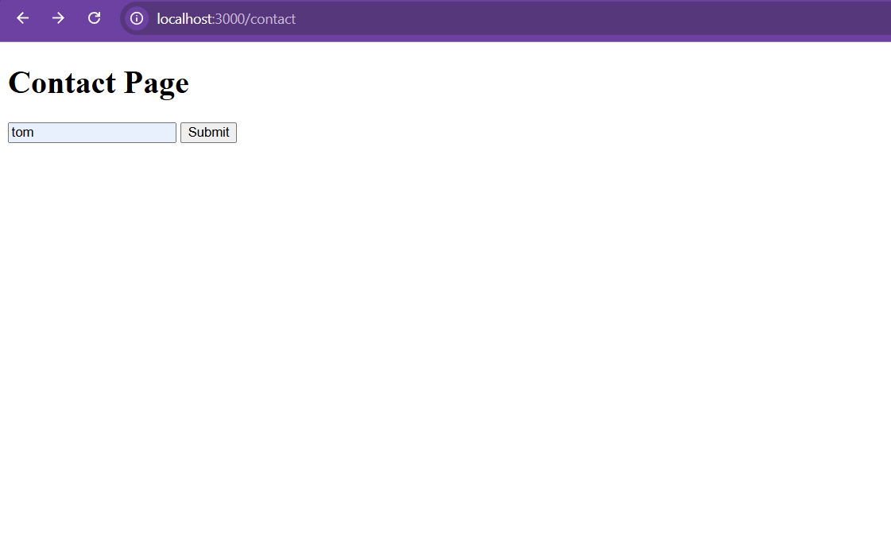
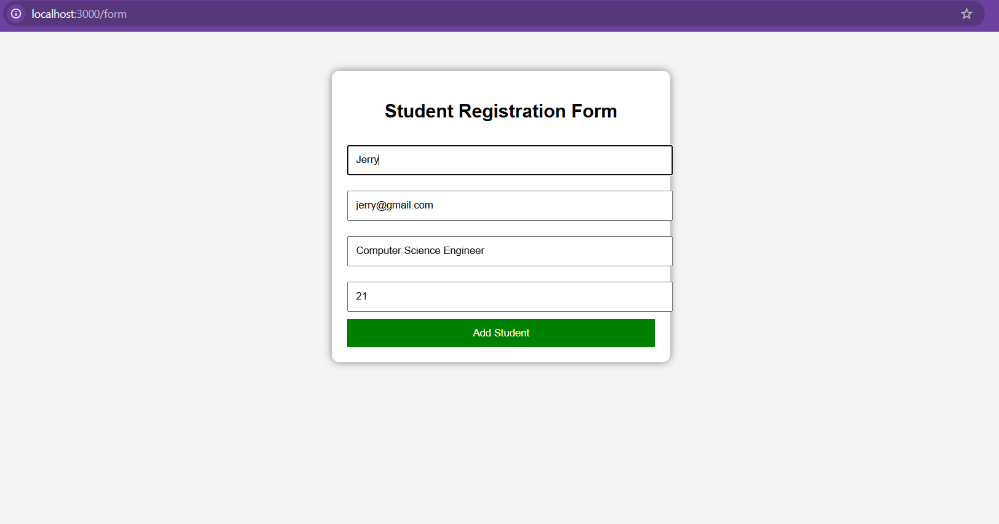
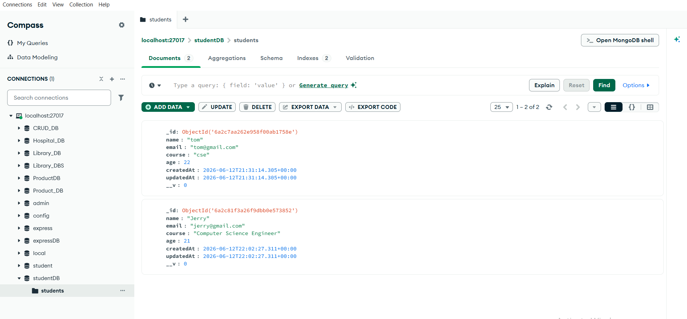

# 🚀 NodeJS-Express-MongoDB-CRUD-Project

A full-stack Student Management System developed using Node.js, Express.js, MongoDB, and Mongoose. This project demonstrates CRUD Operations, Middleware Implementation, MongoDB Integration, HTML/CSS User Interface Design, and Modular Programming.

## 📋 Table of Contents

* Project Overview
* Features
* Technologies Used
* Project Structure
* Installation
* Running the Application
* API Routes
* Database Schema
* Screenshots
* Learning Outcomes
* Author

---

## 📌 Project Overview

This project was developed as part of a Node.js + Express.js + MongoDB assignment. The application manages student records and demonstrates complete CRUD functionality using MongoDB and Mongoose.

---

## ✨ Features

### Built-in Modules

* fs
* path
* os

### Third-Party Modules

* Express.js
* Mongoose

### User Defined Module

* utils/message.js

### Express Routes

* Home Page
* About Page
* Contact Page
* Student Form

### CRUD Operations

* Create Student
* Read Students
* Update Student
* Delete Student

### Middleware

* express.json()
* express.urlencoded()

### Database

* MongoDB
* Mongoose ODM

---

## 🛠 Technologies Used

* Node.js
* Express.js
* MongoDB
* Mongoose
* HTML5
* CSS3
* JavaScript

---

## 📂 Project Structure

NodeJS-Express-MongoDB-CRUD-Project

├── builtInModules

│   ├── fileModule.js

│   └── osModule.js

│

├── config

│   └── db.js

│

├── controllers

│   └── studentController.js

│

├── middleware

│   └── logger.js

│

├── models

│   └── student.js

│

├── routes

│   └── studentRoutes.js

│

├── utils

│   └── message.js

│

├── views

│   ├── home.html

│   ├── about.html

│   ├── contact.html

│   └── form.html

│

├── package.json

├── package-lock.json

└── server.js

---

## 🗄 Database Schema

### Student Collection

| Field  | Type   | Required |
| ------ | ------ | -------- |
| name   | String | Yes      |
| email  | String | Yes      |
| course | String | Yes      |
| age    | Number | Yes      |

---

## 🔗 Routes

### UI Routes

| Method | Route    |
| ------ | -------- |
| GET    | /        |
| GET    | /about   |
| GET    | /contact |
| GET    | /form    |

### API Routes

| Method | Route               |
| ------ | ------------------- |
| GET    | /student/show       |
| POST   | /student/add        |
| PATCH  | /student/update/:id |
| DELETE | /student/delete/:id |

---

## ⚙️ Installation

Install dependencies:

npm install

---

## ▶️ Run Project

Using Node:

node server.js

Using Nodemon:

nodemon server.js

---

## 📸 Screenshots

### Home Page

### About Page

### Contact Page

### Student Registration Form

### MongoDB Records

### CRUD Operations

---

## 🎓 Learning Outcomes

* Node.js Fundamentals
* Express.js Routing
* Middleware Usage
* MongoDB Integration
* Mongoose ODM
* REST API Development
* CRUD Operations
* Modular Programming
* Error Handling

---

## 👨‍💻 Author

Sujeet Rajbhar

Bachelor of Science in Computer Science (B.Sc CS)

Skills:

* Java
* Node.js
* Express.js
* MongoDB
* React
* MySQL

---

## 📄 License

This project is developed for educational and academic purposes.
